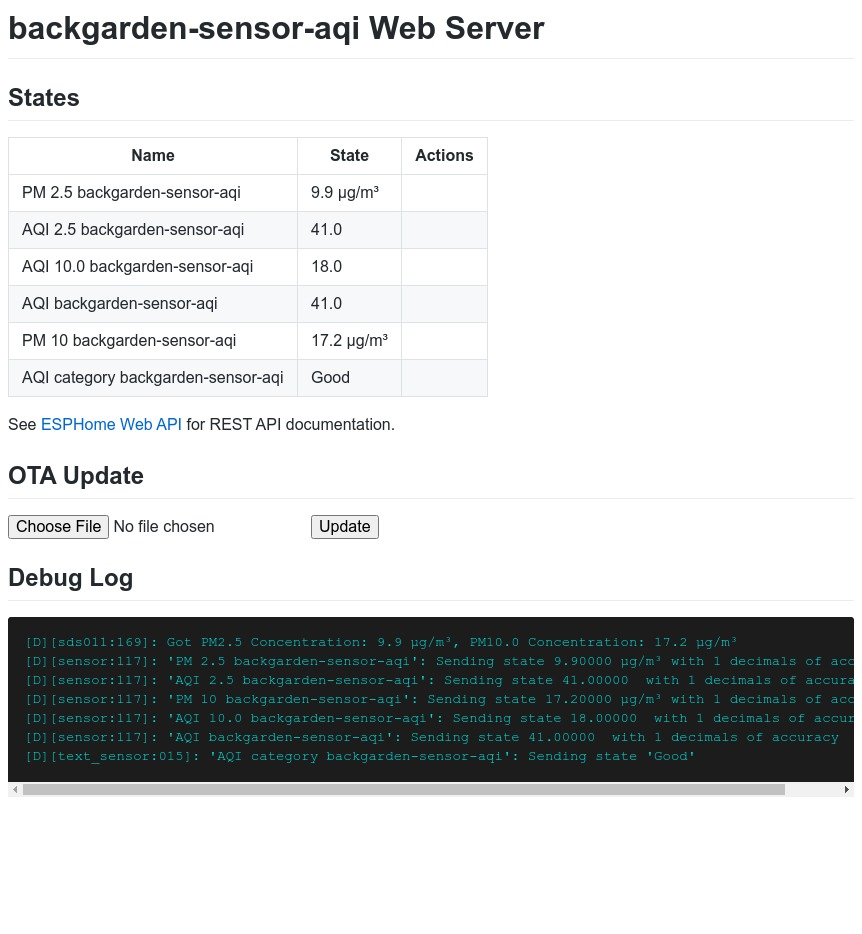

# `aqi-c`

A small C library to convert pollutant concentration to AQI.

Supported pollutants are:

- PM 2.5
- PM 10.0

## Usage in `esphome`

Here is an example usage in `esphome`. The sensor is `SDS011`, and the device
is a generic `nodemcu` board. The device reports raw pollutant values, AQI
values of the pollutants, the combined AQI value, and the category of the AQI
value for human being.

Clone the repository:

```console
mkdir config/include
cd config/include
git clone https://github.com/trombik/aqi-c
cd -
```
Copy [`config/example.yaml`](config/example.yaml)
to your configuration directory.

Build the example:

```console
esphome compile config/example.yaml
```

An example log:

```console
[14:21:48][D][sds011:169]: Got PM2.5 Concentration: 5.0 µg/m³, PM10.0 Concentration: 13.5 µg/m³
[14:21:48][D][sensor:117]: 'PM 2.5 backgarden-sensor-aqi': Sending state 5.00000 µg/m³ with 1 decimals of accuracy
[14:21:48][D][sensor:117]: 'AQI 2.5 backgarden-sensor-aqi': Sending state 20.00000  with 1 decimals of accuracy
[14:21:48][D][sensor:117]: 'PM 10 backgarden-sensor-aqi': Sending state 13.50000 µg/m³ with 1 decimals of accuracy
[14:21:48][D][sensor:117]: 'AQI 10.0 backgarden-sensor-aqi': Sending state 14.00000  with 1 decimals of accuracy
[14:21:48][D][sensor:117]: 'AQI backgarden-sensor-aqi': Sending state 20.00000  with 1 decimals of accuracy
[14:21:48][D][text_sensor:015]: 'AQI category backgarden-sensor-aqi': Sending state 'Good'
```

An example screenshot:




## References

* [Air Quality Index (AQI)](https://www.epa.gov/sites/default/files/2014-05/documents/zell-aqi.pdf)
* [REVISED AIR QUALITY STANDARDS FOR PARTICLE POLLUTION AND UPDATES TO THE AIR QUALITY INDEX (AQI)](https://www.epa.gov/sites/default/files/2016-04/documents/2012_aqi_factsheet.pdf) (page 4)
